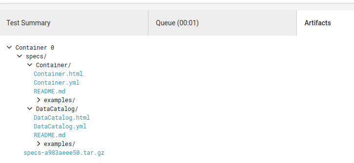

# OpenSchema Container

This is an instance of an [openbases](https://openbases.github.io) builder
to generate a schema.org specification using [map2model](https://www.github.com/openschemas/map2model) for the following entities:

 - [Container](specifications/Container)
 - [ContainerRecipe](specifications/ContainerRecipe)

We will be adding `ContainerImage` and `ContainerDistribution` shortly!
You can also use it as a template, and replace the "Container" entries with your own specification!

## Usage

 1. Fill in the templates provided on Google Drive, and download as tsv. Add the files to the [specifications](specifications) folder here under a subfolder called "Container", along with an entry in [configuration.yml](configuration.yml).
 2. Connect to continuous integration ([CircleCI](https://circleci.com/docs/enterprise/quick-start/#adding-a-project)), which automatically runs the [openschemas/schema-builder](https://hub.docker.com/r/openschemas/schema-builder) container. You will also need to:
   - (optional) define `GITHUB_USER` and `GITHUB_EMAIL` as CircleCI environment variables under settings for a "bot Github account" that you can use to push content back to Github Pages
   - After you add the variables, add the Github bot user to your repository as a collaborator
   - In a different browser, accept the invitation, and then copy paste the CircleCI URL for the project and click "Follow Project"
   - Finally, under the CircleCI project settings (still as the bot) click on Checkout SSH Keys and generate a key for the bot to use.

With this setup, you will automatically generate a mini site that mimicks the [openschemas.github.io](https://openschemas.github.io) to share your specifications.

Importantly, if you look at the Github pages branch, you have a folder of your specification files, 
along with a folder of the rendered templates (that you can submit to `openschemas.github.io` 
for final contribution of your schema!

But never fear if you don't want to connect to Github pages, these same files are saved as "artifacts"
under the circle build (make sure to look under the build step of the workflow):

How does this workflow all happen? Take a look at the files in the [.circleci](.circleci) folder. The 
[config.yml](.circleci/config.yml) is the main driver, and the rest of the files are supporting to create
the web interface.

## Contribute!
Finally, we want to contribute our specifications! This is actually much easier than you
might think. Just grab the file on github pages (or as an artifact) that corresponds to `*.html` 
(e.g Container.html or DataCatalog.html in the images above). And then:

 1. Fork the [specifications](https://www.github.com/openschemas/specifications) repository.
 2. Check out a new branch, add the file to the specifications folder, push
 3. Open a pull request!

That should be it! We are in the process of writing tests so that the contributions there
will be properly tested. Stay tuned!
